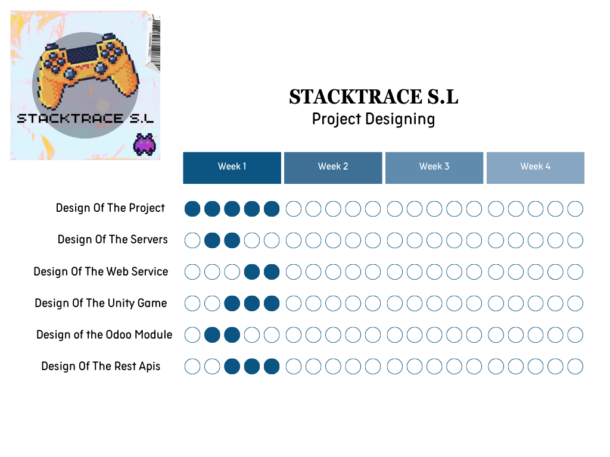
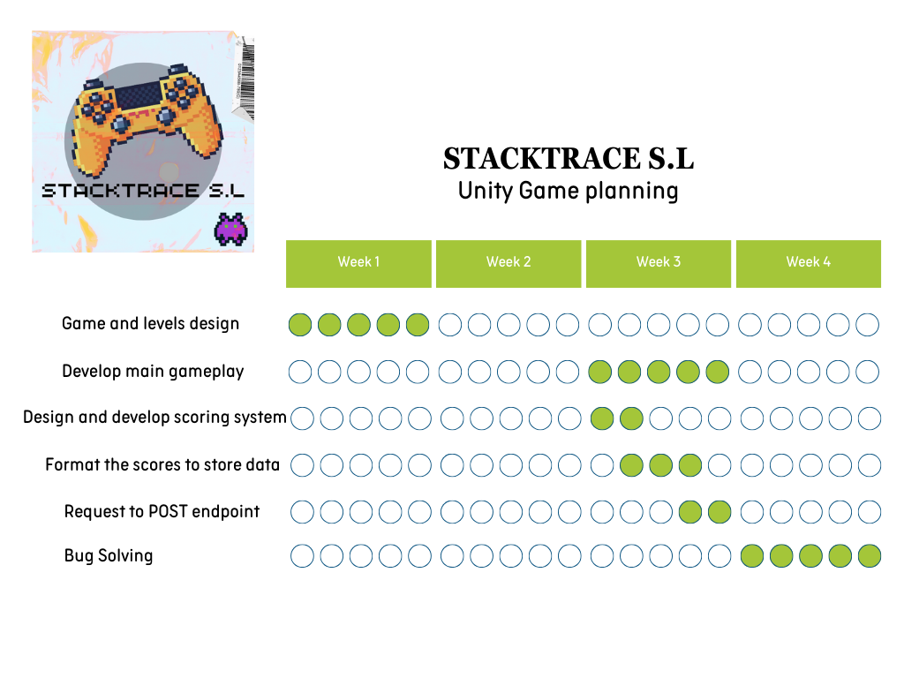
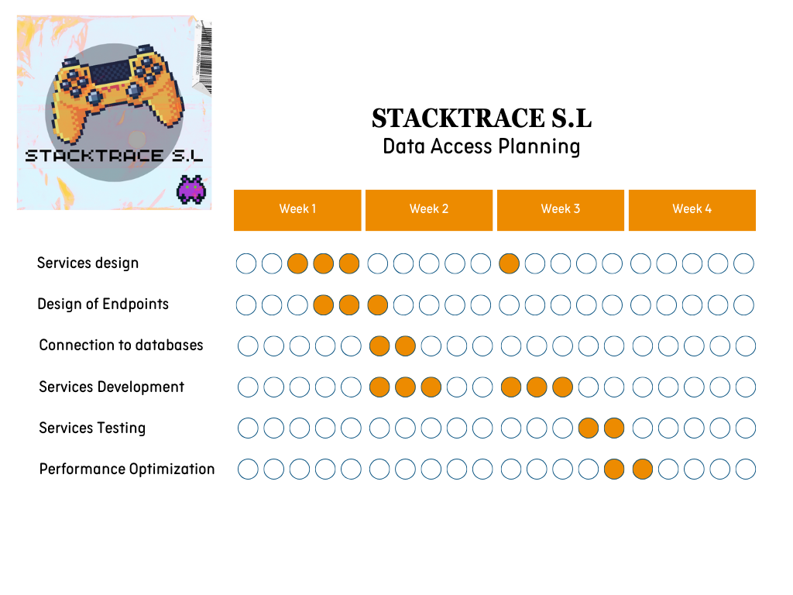
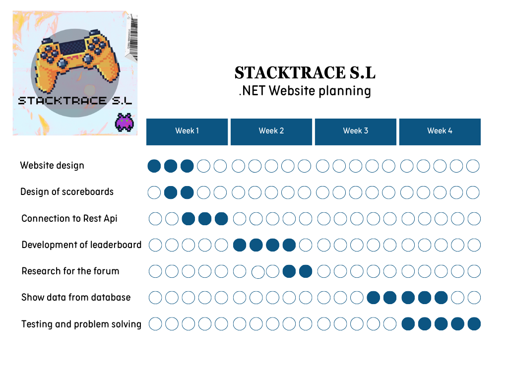
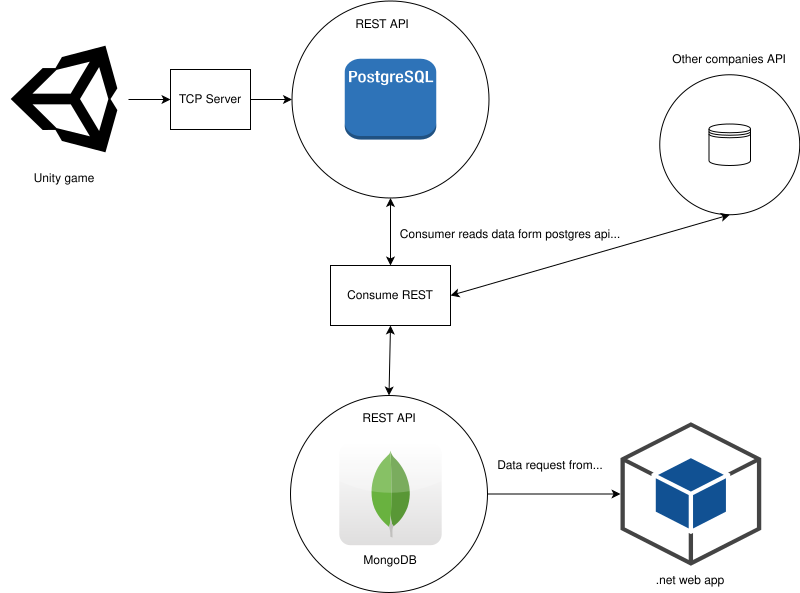

# 1. INTRODUCTION 

Our enterprise is focused on creating information systems implementing them in our clients IT systems. On this occasion we are going to participate in a challenge that is organized between different enterprises. For this challenge we have developed a Arkanoid style game, the challenge itself is to compete in the games that the other teams have developed and try to achieve the highest scores possible on the games. 

The scores data are going to be processed and hosted in our databases. Each team has its own processing system. Those systems are inter-connected and are able to read and load data between the team. Finally the teams are going to post the best scores on a web site, showing the best scores, best players and related information about the challenge. 

# 2. CONTEXT

Collecting and processing data is a crucial and emerging task in the market, enterprises compete in this field to improve their economic activities and to upgrade their services. Data gives more opportunities and complexity to the mentioned activities. That's why they are investing more money in this field over time. Having a good data processing system is a must have nowadays.

Our challenge fits in that aspect, our team has worked to develop a solid information system that allows the team to collect data from other teams and process external data.

# 3. OBJECTIVES 

The main goal is to build a functional service that allows the team to extract data from the game and process it in the backside. The challenge we are participating in is a good way to implement in a semi real case the mentioned system. Developing different types of services and structures is a very important goal but cooperation and research work is also a crucial goal.

With this challenge we are looking forward to keep improving our team working and cooperation skills. Knowing how to work with different types of people and being able to fit in a workgroup is also one of the main goals.

Finally it is important to remark that another main goal is to deepen in the development of projects itself. Working in the technical aspect has been our main focus in the first stages of our formation as developers. But it is very important to focus also on the organizative aspect of the development of projects. This aspect is crucial to keep a strong direction to the project and organize the tasks.

## 3.1 Concrete Objectives 

To complete the main goal we have set some specific objectives. Between these objectives we can highlight these ones:

- Create a new module in our ERP for the specific challenge. This will lead the team to structure and organize the data more efficiently. It will also give an alternative way to insert data if it is necessary. Creating a 
module will also give a connection between the PostgreSQL database and the ERP creating a specific table.
- Create the MongoDB service to host our database and be able to host all the data from other teams too.
- Create three servers, in the first one will be hosted the PostgreSQL and Odoo, in the second one will be hosted the Rest Api’s and the TCP server and in the last one will be hosted the MongoDB service.
- Create two Rest Api’s to do operations with the data from other software of the system.
- Create a ConsumeRest Java application to be able to consume data from other teams databases to our MongoDB database.
- Create a TCP server to insert data that we collect from our game of Unity.
- Create the game itself using Unity game engine, it is an Arkanoid type game and the people from other teams will be able to play it. Our system will process all the data from the sessions that our team mates make in our game.
- Create a MVC .NET web application to visualize the best scores, rankings and even host a forum to have interactions between the users.

# 4. RESOURCES

## 4.1 Technical Resources

Concentrating on the technological assets, computers emerge as the paramount tool for software creation, establishing themselves as an indispensable asset for software development, essentially serving as the foundational material. Shifting focus to more intricate assets, the employment of virtual machines stands out as a pivotal element in constructing our server, with a particular virtual machine being developed using IsardVDI, constructed atop a Debian server.

Managing the software development lifecycle is crucial for facilitating collaboration among multiple developers simultaneously. Leveraging a version control system such as GitHub enables developers to oversee the various phases of the development cycle efficiently. Should any issues arise, reverting to a prior version to resume work is a straightforward solution.

Moreover, GitHub Projects has been instrumental in organizing the tasks for each development segment and in the initial scheduling of these tasks. This platform proves invaluable for overseeing the development process, allowing for the resolution of issues, as well as the tagging and assigning of tasks to distinct developers.

The final technological tool we've embraced is an online multimedia editing platform, Canva. Canva offers the flexibility to craft designs from templates, enabling the creation of customized and visually appealing designs. In our project, Canva was utilized for designing the logo and generating Gantt charts, showcasing its versatility and utility in our development toolkit.

## 4.2 Human Resources

Even with a meticulously planned and defined project, as we advance through its execution, conflicts and discrepancies among team members can emerge, significantly influencing the project's outcome. Often, we overlook the fact that these issues stem from subpar management of human resources, forgetting that the human element represents the most intricate and unpredictable aspect of a project, sometimes acting in contradictory ways.

At the heart of the project is the development team, a group characterized by diverse working styles, skills, and preferences. Achieving effective collaboration among these individuals is crucial for the successful realization of a project.

Managing the human resources of a project involves processes that organize, manage, and guide the project team. This team consists of individuals who have been designated specific roles and responsibilities essential for the project's completion.

To address this, we appointed a project leader and utilized GitHub Projects to meticulously plan and coordinate the tasks and responsibilities of each team member. Leveraging these resources has proven to be an effective strategy for structuring our project. 

# 5. Timing and Responsabilities

## 5.1. Project Design

## 5.2 Unity Game

## 5.3 Data Access

## 5.4 .NET Website

## 5.1. Project Design

| Name  | Role   | Responsability  | 
|---|---|---|
| Unai | Coordinator  | Servers, databases, data flow/access, Rest and Consume Services  |  
| JulenH | Secretary  |  Servers, databases, data flow/access, Rest and Consume Services |   
|  JulenG | Spokes Person  | .NET Website Development |
| Aimar | Helper  | Unity Game Development  |

# 6. TECHNICAL DEVELOPMENT
In the technical development aspect, we had several different programs and systems that we needed to interconnect for our data to travel smoothly and be useful. The data flow was one of the main challenges in this project, and for it to work correctly we needed a solid base for our data. 

We were able to create this solid ground for our data by first focusing on a server architecture that will be the foundation for our whole project. After deliberating with the team and finding the best ways to organize our different services, we ended up with this structure for our system: 

As we can see in the image, the main point of our projects resides in the postgreSQL(Odoo) and MongoDB databases. Both of these databases are surrounded by their respective REST APIs, that allow for data reads, writes, updates and deletes (although we only need read and write). These APIs are consumed by various services in our system. In the next documentation you will see which services and client programs compose our whole system and how they are integrated into the data flow.

We also added different technical development documents for the different aspect of the challenge:
- [Data access](DataAccess/)
- [Services](Services/)
- [Unity videogame](MyLadrillon/)
- [.NET webpage](Interface/)
- [ERP Module (Odoo)](enterprise/)

Apart from this, we also created a [systems administrator's handbook](documentation/Systems%20administrator%20handbook.pdf) that contains information about our servers and their services, as well as acess creadentials and other things.
  
# 7. LINES FOR THE FUTURE

The primary area needing enhancement is undoubtedly our project planning, which fell short in various aspects. Initially, we approached the project with a broad outline of the timeline, yet as the project progressed, we somewhat neglected it and began introducing new features without adequately incorporating them into our planning. Consequently, the project timeline scarcely mirrored the actual progress made. Moving forward, it will be crucial to exercise stringent oversight over the integration of new features, making sure to document and schedule each one meticulously.

Related with the planning, we haven't set an initial plan and time schedule of the project. Setting an initial commit and comparing it to the final schedule we can extract interesting data and point to upgrades in the future. That data can lead the team to be more efficient and accurate in future projects, assigning to each task the respective and appropriate time to develop it correctly.

Teamwork and cooperation is another thing that we can upgrade a bit. The tasks were assigned according to personal capacities and interests, which is good in certain aspects but maybe is better to assign them based on other aspects. 

The amount of team reunions and its quality is another task to improve for future projects. The reunions can offer to the team important information about the development process, for example the state of each task, problems, bugs and that type of information. Identifying those aspects and locating them can be a key aspect to improve the direction of the project and to prevent other problems in the way. We can say that developing our communication skills can be beneficial to the project and can definitely be an aspect to improve.

If we focus on technical details we can't extract much. The technical part has been improved and has flow correctly. Maybe we can say that frontend aspects like the design of the interfaces of the game and web app are more poor but in general we are happy with the result. Offering more time to the artistic design can be beneficial to the user experience. Maybe it is a small mistake to focus a hundred percent on the functionality itself. 

The data flow to our databases can be another aspect to improve. On this occasion we have worked with a small amount of data quantities but it can happen that in the future we are going to be needing a more efficient data flow. Efficiency and speed in this task is a key for optimizing the system we are working with, that's why adding more sophisticated tools or structuring the process to achieve this can be a very important thing to improve. As said before in this challenge the data flow was quite small so we have been able to process it but adding more speed and efficiency to the process could be perfect.

Another point to be better is in the realm of authentication and security, specially API security. It is typical that the more delicate endpoint (usually the PUT, POST and DELETE  endpoints) are secured behind an authentication layer, like OAuth. We haven’t done this, mainly due to time constraints and lack of a requirement, but we feel like it is a major point of improvements for our APIs.

# 8. CONCLUSIONS

Taking all the process into account we can say that clearly we have improved the development process and the communication between the team members. This has given as a result a better system and a better result.

In general we have improved and learned how to create a multi directional data flow system. We have found a way to create a more sophisticated and complex data processing system creating Rest Apis. The gaining of real life applicable skills and being able to apply them in an enterprise is also another aspect of this challenge, the variety of the software developed in the process has been bigger than the first challenge. 

This time the tasks were divided in a more equitable way giving each member more time and resources to develop the mentioned tasks. The cooperation also has been another aspect that has been improved. Some members have finished their assigned tasks quicker than others and they have been helping the ones that didn't finish their tasks.

We have also realized that all the backend part of the project has conditioned the rest process. The web app is the one that has been more affected in this aspect, the web app needs data to process and to be shown. So the member that has been responsible for developing it has been waiting until the data process system was finished. That's why the backend part has been the first feature of the project that has been finished.

Entering the security part, we can say that our server has very rudimental and basic security layers. We have just used the UFW firewall to block the connections and ports that we are not going to use. For the future we must better secure our servers to avoid attacks and vulnerabilities that can affect our system.

